# Bookmark Manager

## Heroku
The following code in master is now up in **heroku**! To see what it looks like, please visit this [site](https://bkmkmanager.herokuapp.com/).

## Quick Updates

**v0.0.1**
- Added persistency by saving all the bookmarks in the local storage
- Added option to edit a bookmark - have used a dialog for this one
- Changed the buttons in a bookmark card into a button icons, where one is for editing and deleting
- Edited tab name
- Fixed some logic and layout of the site

**v0.0.2**
- Added validator for the URL field in both Add/Edit Bookmark - just don't put "www." or "https://www." or "http://www." at the start please :) 
- Fixed css for greying out the button when you cannot edit/add a bookmark
- Centered the title of "Edit Bookmark" upon opening the dialog of editing a bookmark

**v0.0.3**
- Utilized bootstrap more for designing the layout of the elements in the HTML and added/edited CSS if needed
- Finally horizontally and vertically centered the text if the user has no bookmarks added yet
- Changed logic of checking the URL as there now will be two checks: if URL is valid AND has a protocol
- Changed logic of generating a new ID for each bookmark, but there is a remote chance of collision, will fix this soon
- Fixed the layout of the forms (edit and add) to show the error messages properly, specially in the URL field
- Removed the "www." prefix in both edit and add bookmark forms
- Width of the edit bookmark form will vary depending on the width of the screen
- Bottom margin of the add bookmark form will vary depending on the width of the screen
- Different error messages will be shown in the URL field if the URL inputted is either invalid and/or has no protocol

**v0.0.4**
- Centered contents of the card instead of aligning to the left
- Clicking on the hyperlink with the left mouse button now opens the link into a new tab instead
- Hover was implemented on the hyperlink and on the content copy icon
- Speaking of content copy icon, clicking on it will copy the link corresponding to that card
- Added a snackbar message once the link is copied successfully to the clipboard
- Changed the overall font of the entire application
### Following section below is for a different purpose, please ignore it

Original Solution (v0.0.0)

## Solution Description (v0.0.0)

My solution to this use case involves the use of the following libraries in Angular:
- `ngrx` for handling the state management
- `@angular/material`, `bootstrap`, `@angular/flex-layout` for the user interface

Regarding state management, the store that I have consists of the following:

**Model**
- defined as an interface with the following properties
    - Title (Name) - **considered this as my unique id**
    - URL
    - Group

**State**
- consists of an array of bookmarks with the type Bookmark, which is defined as an interface

**Actions**
- consists of two actions namely:
    - `addBookmark`: where it takes in a bookmark prop to be added to the state
    - `removeBookmark`: where it takes in a bookmark prop to removed from the state

**Reducer**
- created a reducer for the logic of the two actions:
    - For the `addBookmark`, I have used the `find` function in the state to check if there is currently a bookmark that has the same title as to the title being added. This is done to avoid adding duplicates. If there is already a bookmark containing that specific title, the state remains the same. Else, the state will be changed where the new bookmark is added to the state.
    - For the `removeBookmark`, I have used the `filter` function in the state to return a new state without the bookmark being removed.

The code for all these is found in `src\app\state`.

Regarding user interface, I have mainly created two components, along with the app component, via code scaffolding, namely: `bookmarks` and `add-bookmark`:

**Add Bookmark Component**
- This component basically is a form where the user will add a bookmark. There are three inputs: "Name" where user types in the bookmark name; "URL" where user types the website **WITHOUT** the "www."; and "Group" where user types in the group of the bookmark.
- The code for this component is found in `src\app\add-bookmark`.

**Bookmarks Component**
- This component basically shows the bookmark/s the user has added. If there are no bookmarks yet (either via deleting all or user did not put any bookmarks yet), a message will appear. If there is a/are bookmark/s already in the store, the message will not appear anymore and instead will have the bookmarks shown, where each bookmark is in a card. In each card, it contains the following: name of the bookmark on top; the URL, that is a hyperlink, where the text is "Click here to go to link!"; the group the bookmark belongs to; and a button in the lower-left to delete the bookmark.
- There is also a dropdown to display the bookmarks grouped by the "group" property. By default, the option is "All", where it will show all bookmarks. Once there are multiple bookmarks with multiple groups, the user can use the dropdown to select which group of bookmarks the user wants to see.
- The code for this component is found in `src\app\bookmarks`.

**Unit Testing**
- The unit test involves the following tests per each component (code can be found in their respective `spec.ts` files):
    - App Component
        - Check if this component has been created
        - Check if the title "Bookmark Manager" is found there
    - Bookmarks Component
        - Check if this component has been created
        - Check if removing a bookmark works when the dispatch is called
    - Add Bookmark Component
        - Check if this component has been created
        - Check if the title of the card is "Add Bookmark"
        - Check if form is valid/invalid depending on the inputs
        - Check if adding a bookmark works when the dispatch is called

**Limitations of the Solution**
- The validation in the form is not fully implemented, particularly in the URL as there is no check if the URL ends properly (i.e. no check if the website ends in .com/.org etc.).
- In terms of deleting a bookmark, there is no warning first to the user if the user is sure to delete the bookmark or not.
- ~~Refreshing the page will fully remove all bookmarks, as the local storage is not implemented here.~~ I have already implemented the persistency using `ngrx-store-localstorage` in version 0.0.1
- The user interface can be further improved.
## Screenshots of the Solution

**Initial State**

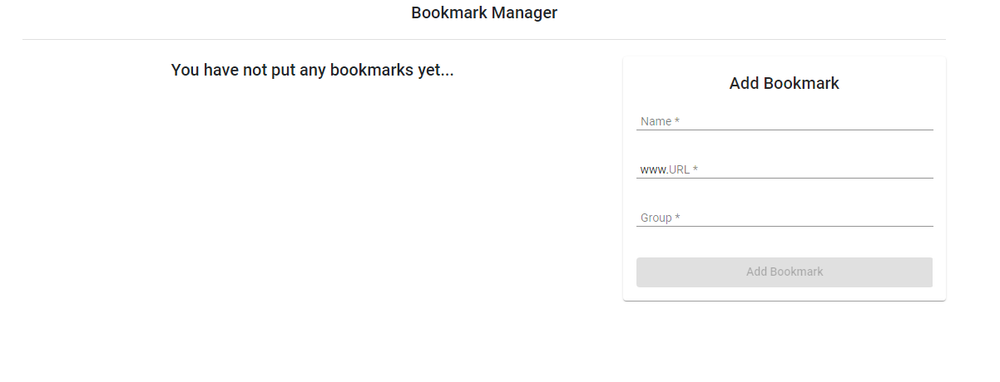

This will show up once the site is first loaded. The "Add Bookmark" button is also disabled in this case. It will be disabled until the user fills out all the three fields. The message will also show up in the Bookmarks component that the user has not yet added any bookmarks.

**Adding a Bookmark**

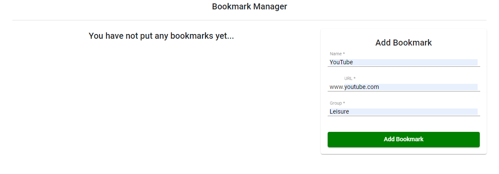

Once all three fields are filled out, the "Add Bookmark" will now be enabled.

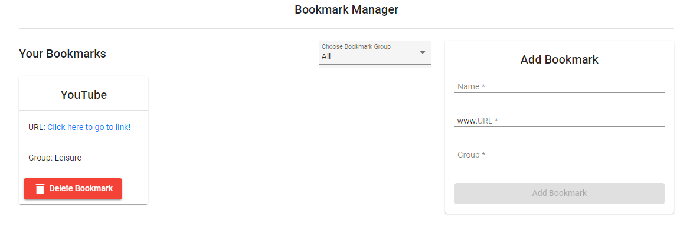

Once the "Add Bookmark" is clicked, the form will be reset. Now, the user has added one bookmark and as mentioned in the solution, the default bookmark view will show all bookmarks.

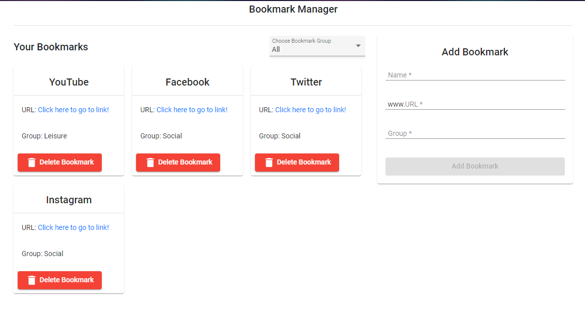

Here, the user has added three other bookmarks, where all three are Social bookmarks.

**Change Bookmark View by Bookmark Group**

A user can change the bookmark view by clicking the dropdown found and then choose a specific group to show bookmarks for that only specific group.

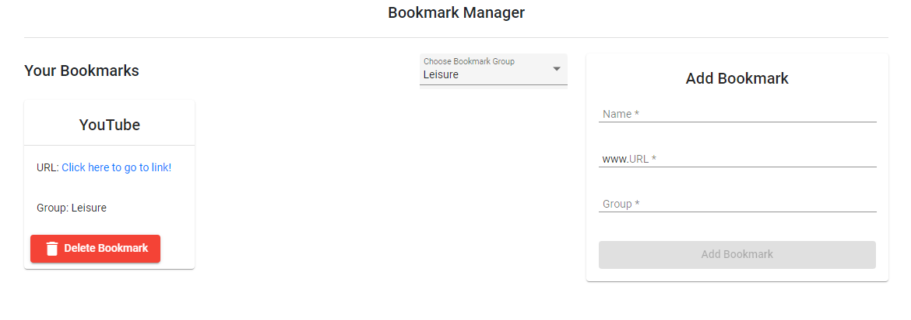

Here is what happens when the "Leisure" option is selected.

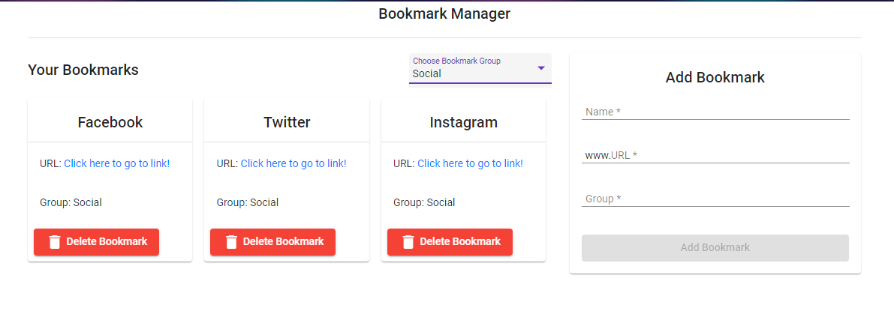

Here is what happens when the "Social" option is selected.

**Deleting Bookmark/s**

A user can delete a bookmark by clicking the "Delete Bookmark" button found in a card containing the information of the bookmark a user has saved. Coming from the Social bookmark group, the user decides to delete the bookmark for Instagram.

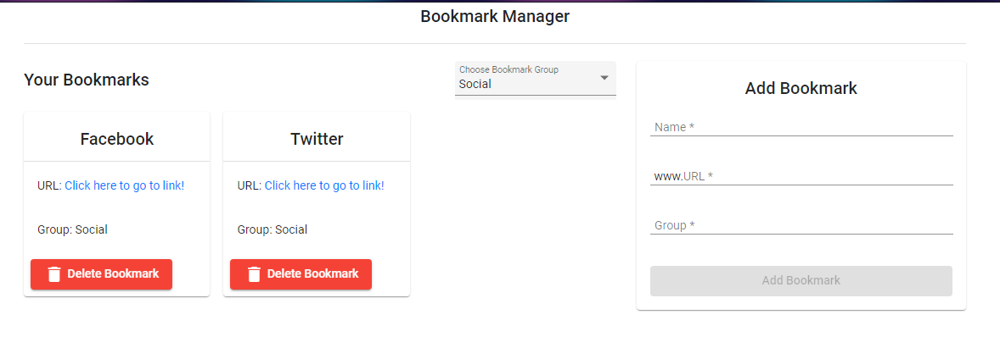

Once clicked, the bookmark for Instagram has been deleted, and the view still stays in the Social bookmark group.

**Adding/Deleting Special Actions**

If a user is currently in a bookmark group view where there is only **ONE** bookmark for that group, and the user decides to delete that one and only bookmark for that bookmark group, the view will be back to All bookmarks.

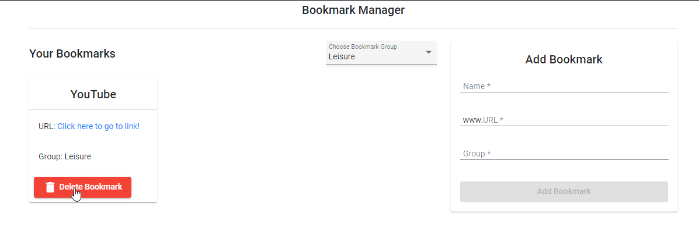

The user currently has the view in the Leisure bookmark group, and as we can see there is only one bookmark for the Leisure group. If the user then proceeds to delete this...

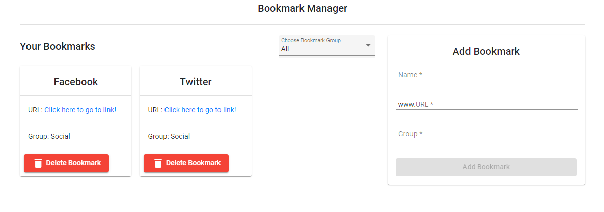

Then, the view will now be back to All Bookmarks.

If the user is currently in a specific bookmark group view and wants to add a bookmark to a different/new group, then the added bookmark will not be in the current view.

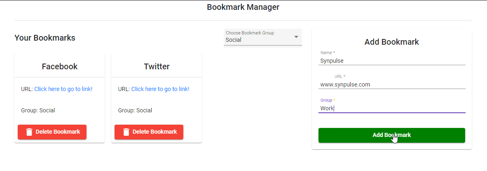

Here the user currently has the view in the Leisure bookmark group and decides to add a new bookmark with a different group.

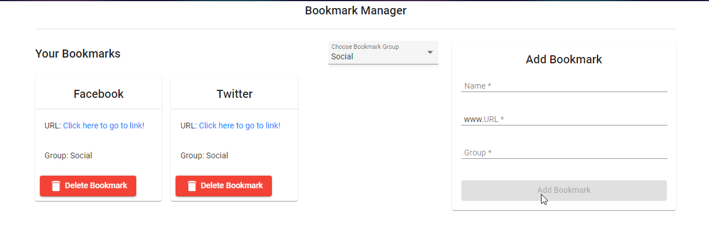

After adding, the added bookmark will not be reflected in the current view as it has a different bookmark group.

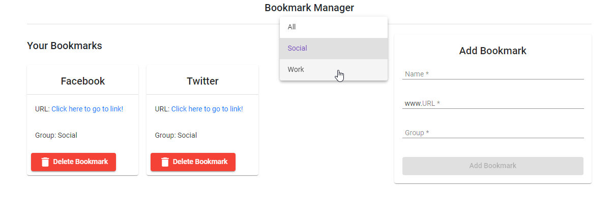

Upon clicking on the dropdown, the user can see that the new group has been added to the options.

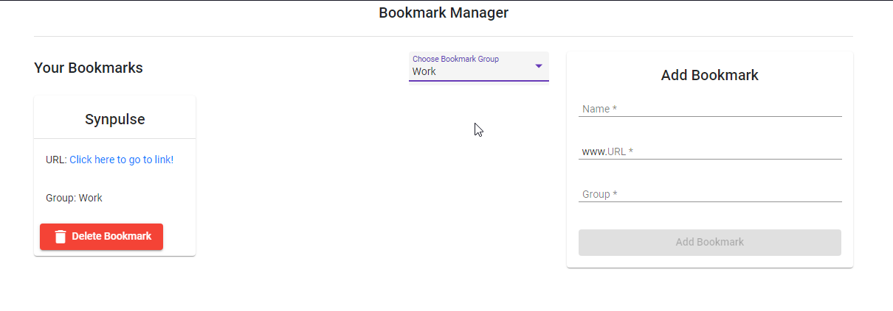

From here, the user can now see the added bookmark, with the view of the new bookmark group.

## Running the Solution

1) Choose a directory (either via creating or choose existing) on where to put the code. In this example, I will use "C:\Projects\".
2) Open a command line/powershell in that folder. If you have `git` installed, you can type in the command line/powershell `git clone https://github.com/brainfrozeno00o/bookmark-manager.git` to clone the current repository. If not, you can download the file via ZIP file, and extract it to "C:\Projects\" (based on example).
3) To make sure the site can be run locally, the following needs to be installed:
    - Node.js and NPM: A good guide can be found [here](https://phoenixnap.com/kb/install-node-js-npm-on-windows) on how to install them.
    - Angular CLI: A good guide can be found [here](https://angular.io/cli) on how to install this.
4) Once all are installed, open a command line/powershell on the folder where the source code/repository is contained. In my example, it will be most likely "C:\Projects\bookmark-manager" if you used Git. But if via ZIP, it will be most likely "C:\Projects\bookmark-manager-master".
5) Type `npm install` to install all the dependencies needed to make the website work.
6) Once done, you can type `ng serve` to run the dev server. To access the site, proceed to `http://localhost:4200/`.
7) In case you want to do unit tests, you can type `ng test` to check the tests per each component.

